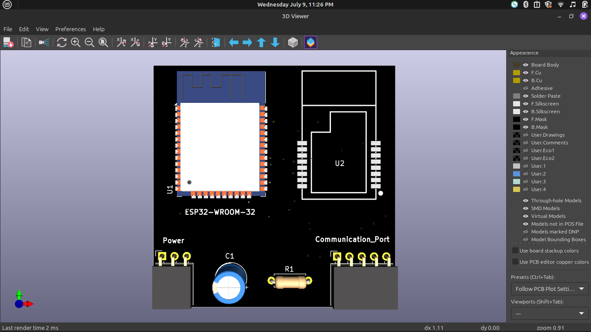
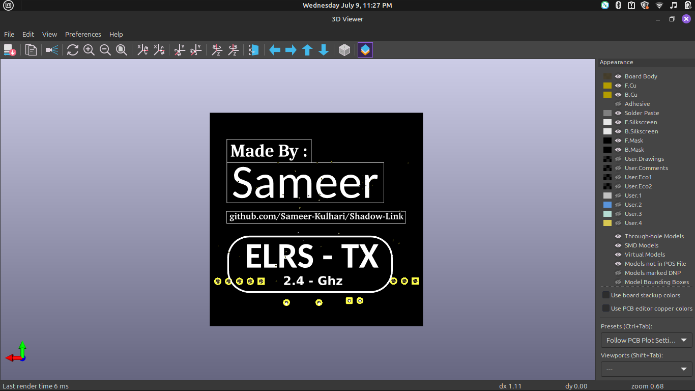

# June 8th : Design the idea and working of project

#### I figured out how should my Transmitter module will work and how can i build this.I researched a lot about transmitter and found some cool things about them and what i can do to make a professional Transmitter module like Radio-Master and Flysky mid to high range ones.while researching i found that all proffesional grade ones support ERLS which is open-source projects so,I can use them in my transmitter module
#### Finally I have a idea about the working and functionality of my transmitter in pen and paper ...XD...

**Total time spent = 4.5 hr**
---
# June 9th : Design the schematic and pcb for ELRS-TX .
#### I made the schematic and pcb of ELRS-TX in kicad.I also attached the images of all layers of pcb,schematic and 3d view of pcb in the github repo with the gerber files and libraries used in pcb.
### Here are some images :
|  |  |

**Total time spent = 3.5hr**
---
---
# June 10th : Design the pcb and choose parts for ELRS-TX
#### I first make a list of components which will be used in transmitter module and then make a schematic according to it and then I make a pcb according to it in which the ELRS-TX pcb can be inserted easily so it can be used as plug and play module. 
