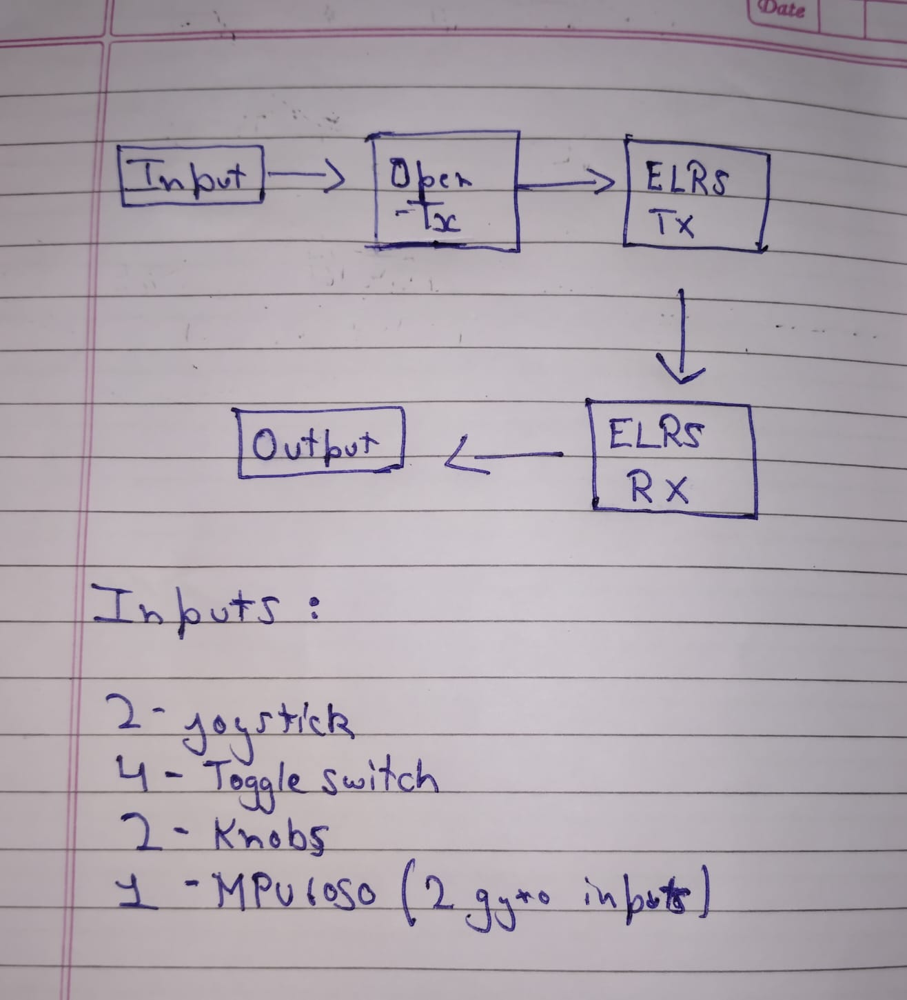
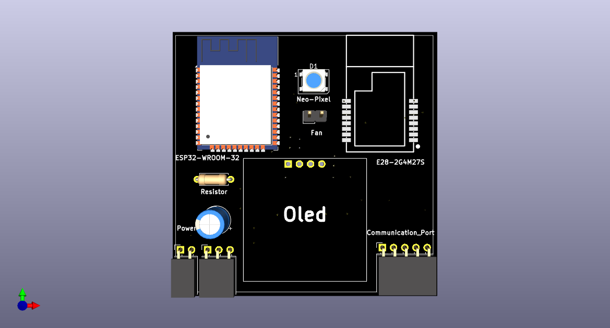
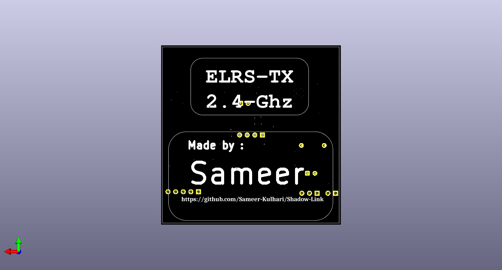
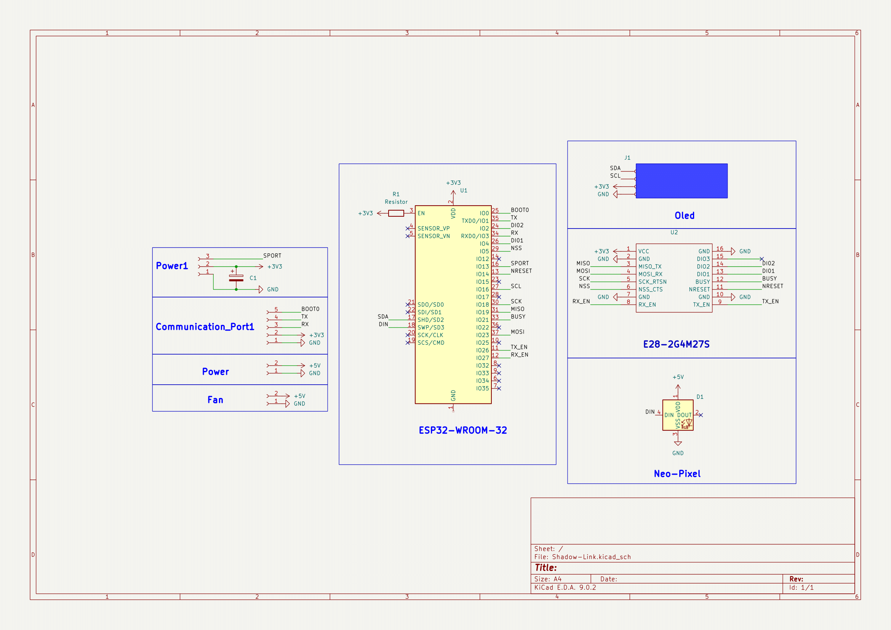
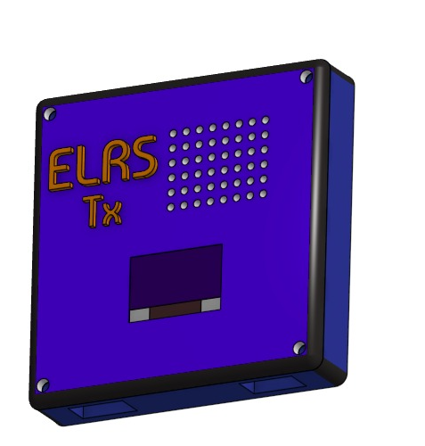
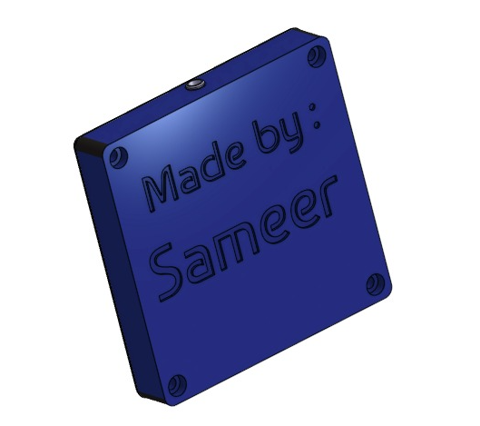

**Total Time Spent : 24hr**
---

# Project Journal – DIY ELRS Transmitter Module  
**By Sameer Kulhari**

## June 8th: Designed the idea and working of the project

Today, I figured out the full concept of how my transmitter module will actually work and how I can build it from scratch. I spent a lot of time researching how professional transmitters like **Radiomaster**, **Jumper**, and **Flysky** are built and what features they have.

One cool thing I found is that most of the mid to high-end transmitters support **ExpressLRS (ELRS)** — which is open-source! That was a big moment because it means I could also use ELRS in my own DIY transmitter module.

After all the research, I now had a clear idea of what I wanted to make — how the transmitter will function, what components it’ll need, and even how it should look. I drew the full plan on paper.

**Total time spent: 4.5 hours**

---

##  June 9th: Designed the schematic and PCB for ELRS-TX

Today I moved from planning to actually designing. I used **KiCad** to create the full schematic and layout for my **ELRS-TX** board.

Once the PCB was ready, I exported the **gerber files**, added all the **libraries**, and uploaded **layer images** and a **3D view** of the PCB to my GitHub repository so everything stays well-documented and reproducible.

**Here are a few images from the repo:**

  
  

**Total time spent: 3.5 hours**

---

## June 10th: Updated PCB and added new parts for ELRS-TX

Today I focused on upgrades and made the board even better!

I first created a list of new components that I could add to make the transmitter feel more pro-level. After that, I updated the schematic with these parts and redesigned the PCB to make it **modular** — so the ELRS-TX board can be plugged in easily and used as a **plug-and-play module**.

### New features I added:
-  **Cooling fan** for stable performance
-  **NeoPixel** for status indication
-  **New power input option**

The final schematic looks clean, and the new board layout is compact and efficient.

**Total time spent: 4 hours**

---

##  June 12th: Started designing the case

Today I worked on the outer casing of the transmitter. I took all the dimensions from the PCBs and components and then used **Onshape** to start designing the case.

It’s still in the prototyping stage, but the fit looks really good!

Here are some preview pics:

  
  

**Total time spent: 5 hours**

---

## June 13th: Parts sourcing + README update

I researched and finalized where to buy all the components — including the ESP32, E28 LoRa module, OLED, and other parts.

After that, I updated the **README file** and this **journal log** to include all the new changes and features I’ve added over the last few days.

Now the project is fully documented and ready to share! 

**Total time spent: 3 hours**
