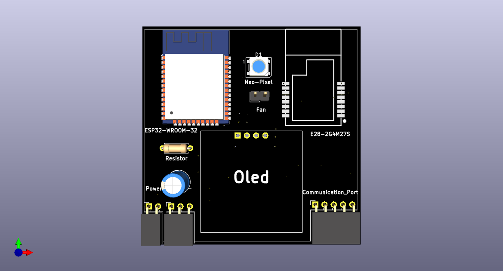

# Shadow-Link
A diy high performance Transmitter Module with ELRS support and custom hardware which can transmit data using Sx1280 RF module and ESP-32.
This Transmitter module works on a open source Firmware called ELRS ,which is used in high end transmitters and recievers

# Features :
- 15km + range (LOS)
- 5ms latency
- Oled and RGB
- External Antenna
- ELRS support
- Custom case and Pcb

# Parts Used :
- ESP-32 WROOM
- E28-2G4M27S (SX1280)
- NEOPIXEL (WS2812)
- 0.96" I2C SSD1306
- MP1584 Step Down Regulator

# Images :
**PCB :**

  
  
  

**CAD :**

  
  

# BOM :
| Supplier             | Item                                           | Price (USD) |
|----------------------|------------------------------------------------|-------------|
| **Quartz Components**| Oled SSD1306                                   | $1.60       |
|                      | MP1584 Voltage Regulator                       | $0.50       |
|                      | RG81 Ipex to SMA                               | $0.50       |
|                      | 12 dbi Antenna                                 | $2.10       |
|                      | Usb to TTl converter                           | $0.70       |
|                      | Colling Fan                                    | $0.84       |
|                      | Battery                                        | $3.26       |
|                      | Misc                                           | $2.00       |
|                      | Shipping                                       | $2.54       |
|                      | **Total (Quartz Components)**                  | **$13.94**  |
| **Lion Circuits**    | PCB                                            | $11.54      |
|                      | Shipping                                       | $2.33       |
|                      | **Total (Lion Circuits)**                      | **$13.87**  |
| **SemiNest**         | E28-2G4M27S                                    | $16.9       |
|                      | ESP32-WROOM-32E-N16                            | $8.85       |
|                      | Shipping                                       | $2.33       |
|                      | **Total (SemiNest)**                           | **$28.08**  |
|----------------------|------------------------------------------------|-------------|
|**Total**             |                                                | **$55.89**  |

